# Projektinformationen
Projekt für das Modul Accessibility

Erstelltt von: 
+ Dean Braband 

## Projekt starten

Das Projekt verwendet Node.js und einen Express.js-Server für das Backend.
 
Das Backend is in javascript geschrieben, und verwendet eine SQLite-Datenbank.
 
 
Um das Projekt zu builden und den Server zu starten muss folgender Befehl in die Kommandozeile eingegeben werden: `npm run test`
 
Falls npm nicht gefunden wurde müssen die Binärdateien von Node.js der Umgebung bekannt gemacht werden.
Dies könnte Beispielsweise wie folgt aussehen: `export PATH="$HOME/Desktop/Accessibility.git/node-v24.11.0-linux-x64/bin:$PATH"`
 
 

## Genutzte Tools
### Linting
+ eslint

+ lesshint

### Bundling
+ esbuild
    + `esbuild ./webapp/src/js/Main.mjs --log-level=warning --bundle --outfile=./webapp/dist/bundle.js`

### Minify und Obfuskation
+ lessc
+ terser

## Gewählte umgesetzte WCAG_2.2-Kriterien für das Projekt

### AA
1. 3.2.4 Consistent Identification
    
   Components that have the same functionality within a set of web pages are identified consistently. 
   - Knöpfe haben das Gleiche Design, und ähnliche Komponenten sind konsistent in deren Aufbau. Z.B. sind die Inhalte und Reihenfolge der To-Do-Objekt-Abschnitte auf allen Seiten konsistent gehalten.
   
  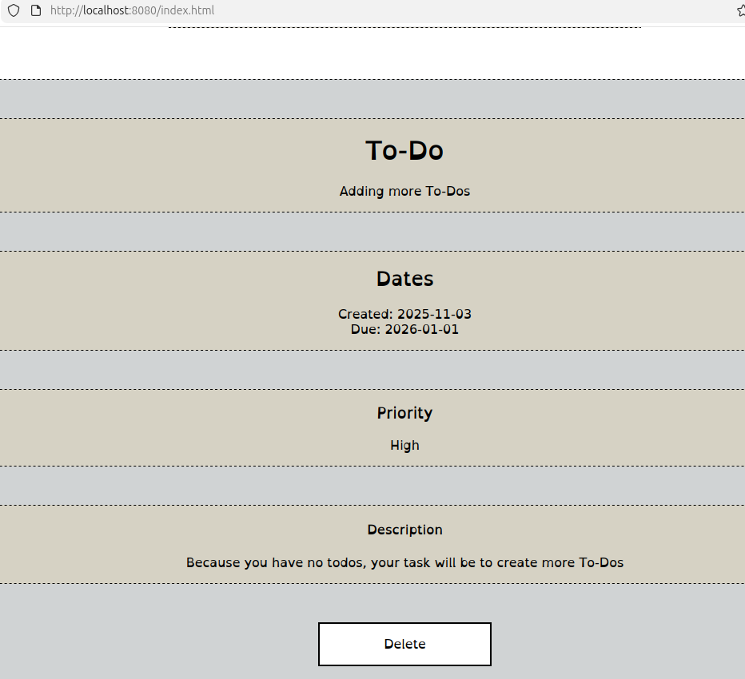
  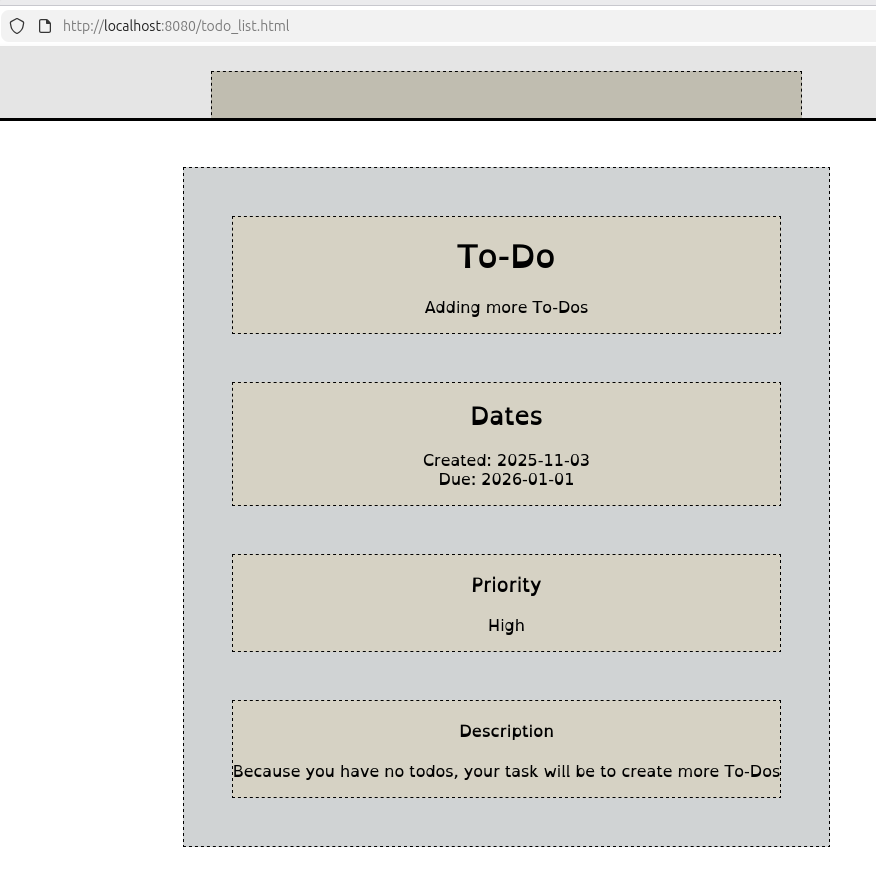
  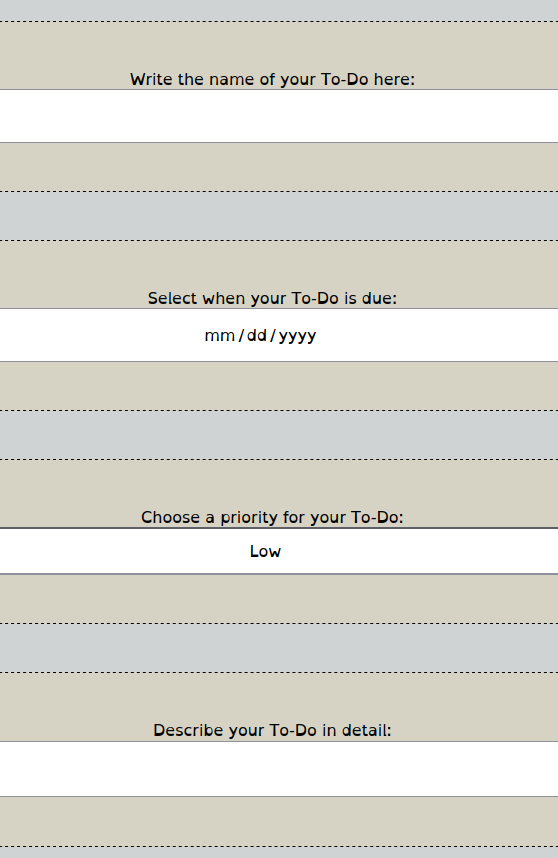

1. 3.2.3 Consistent Navigation
    
   Navigational mechanisms that are repeated on multiple web pages within a set of web pages occur in the same relative order each time they are repeated, unless a change is initiated by the user.
   - Die Navigation auf jeder Seite ist identisch geregelt, der einzige Unterschied ist, dass die momentane Seite auf der der Nutzer sich befindet, gehighlightet wird
   
  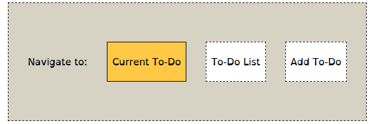
   
2. 1.4.10 Reflow
     
    Content can be presented without loss of information or functionality, and without requiring scrolling in two dimensions for:
     
     
    Vertical scrolling content at a width equivalent to 320 CSS pixels.
     
    Horizontal scrolling content at a height equivalent to 256 CSS pixels.
    - Ich habe überall keine Scrollbars verwendet und darauf geachtet, dass mein Design bei 320 x 256 keine Overflows besitzt.
     
    Meine Seite ist nur vertikal scrollbar.
     
    Anschließend habe ich die Bildschirmgröße im Browser auf 320 x 256 gestellt und getestet.
     
    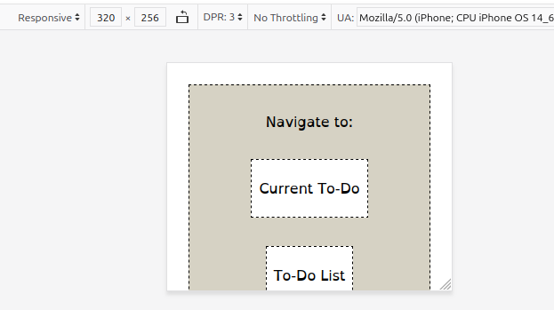
    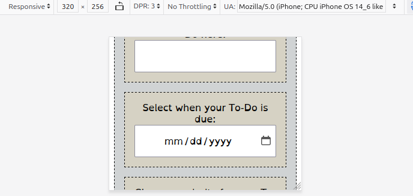
    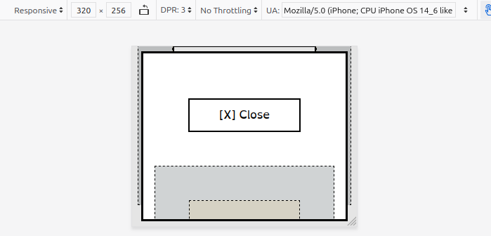

3. 1.4.4 Resize Text
     
    Except for captions and images of text, text can be resized without assistive technology up to 200 percent without loss of content or functionality.
    - Ich habe dies umgesetzt indem ich einfach die Elemente solange angepasst hatte, bis dies der Fall war. Getestet habe ich dies, indem ich die Webseiten größe auf 200% im Browser gesetzt habe.
     
    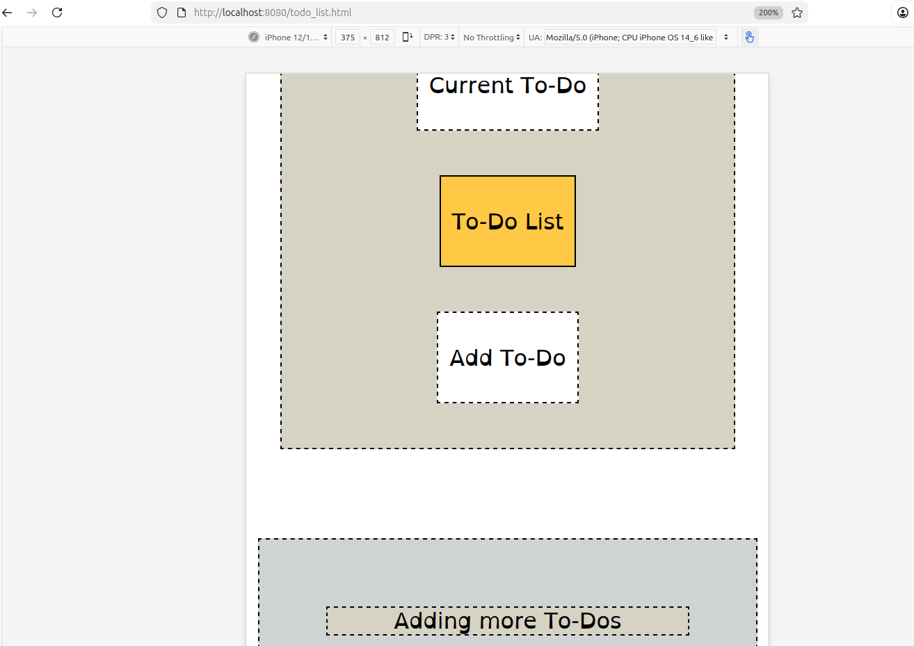
    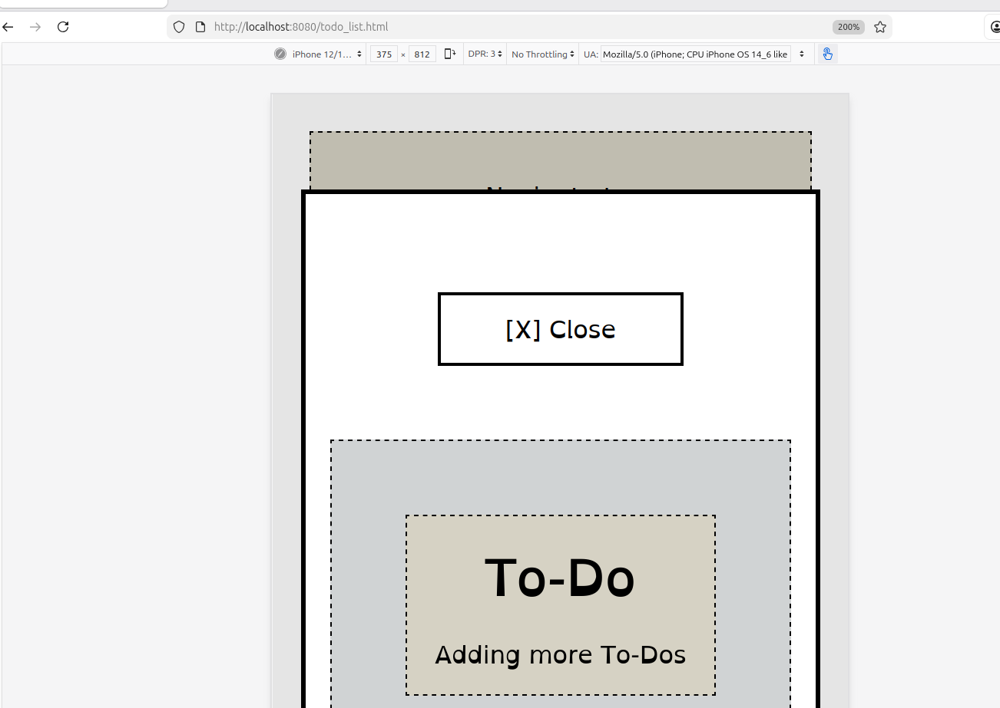
    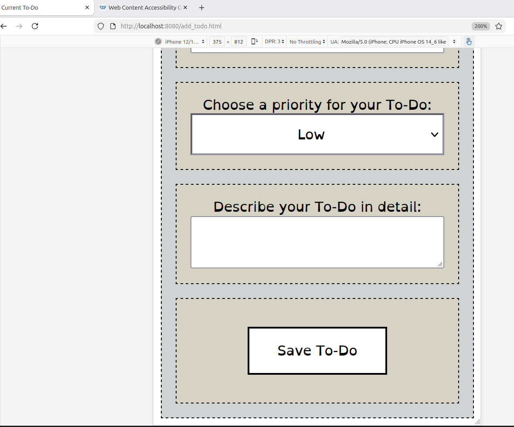
   
4. 1.3.5 Identify Input Purpose
     
    The purpose of each input field collecting information about the user can be programmatically determined when:
     
     
    The input field serves a purpose identified in the Input Purposes for user interface components section.
     
    The content is implemented using technologies with support for identifying the expected meaning for form input data.
    - Ich habe die offiziellen HTML-Tags verwendet, um die DOM-Objekte direkt semantisch korrekt zu definieren.
     
    Zudem habe ich Labels mit Beschreibungen für die Elemente verwendet.
     
    Aria-Lables beschreiben die Input-Elemente desweiteren textuell.
     
    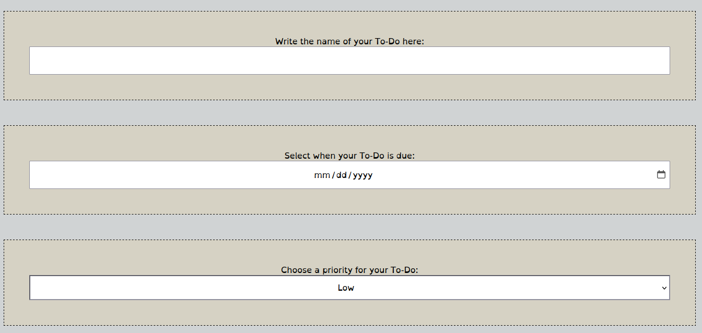
    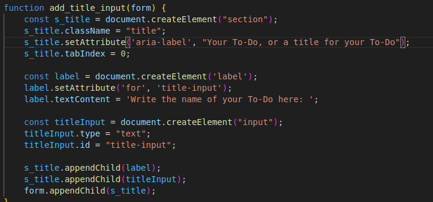

5. 1.3.4 Orientation
     
    Content does not restrict its view and operation to a single display orientation, such as portrait or landscape, unless a specific display orientation is essential.
    - Ich habe diese Anforderung umgesetzt, indem ich eine css-Datei für beide Ansichten erstellt habe und über eine Media-Query die Änderungen dynamisch an die Bildschirmgröße angepasst.
     
     
    Getestet habe ich die Ansichten mit Firefox.
    Das kleinste Gerät für welches ich eine gute Ansicht garantiere ist das iPhone12/13 mini.
    Diese Entscheidung habe ich getroffen, da die Schrift auf der Seite ansonsten verkleinert werden müsste, und dann nicht mehr gut lesbar wäre.
     
    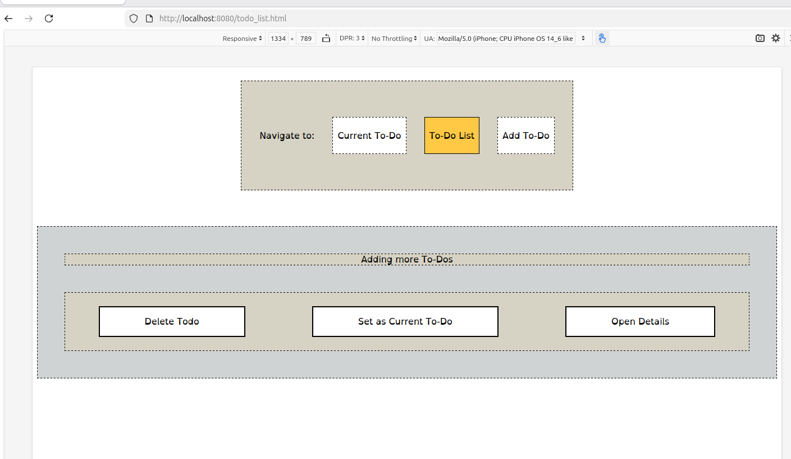
    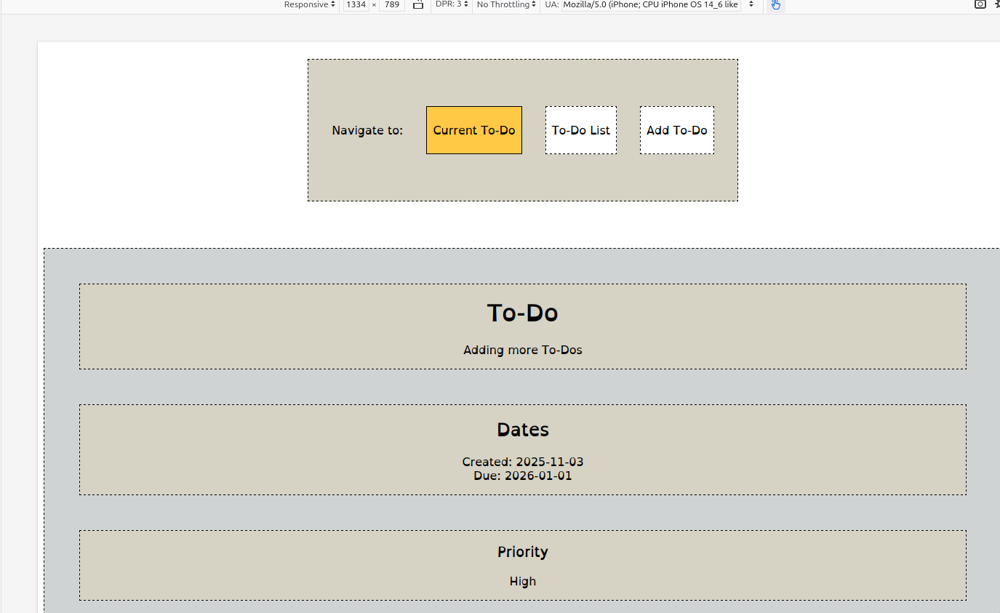
    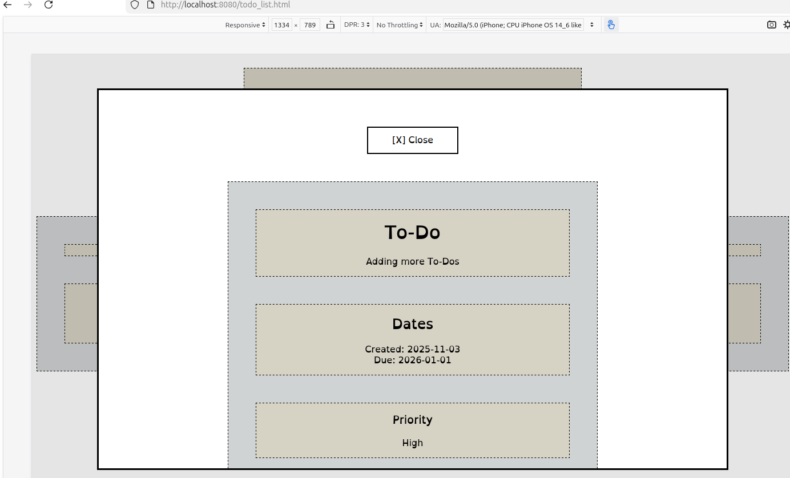
    
    
    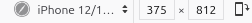
    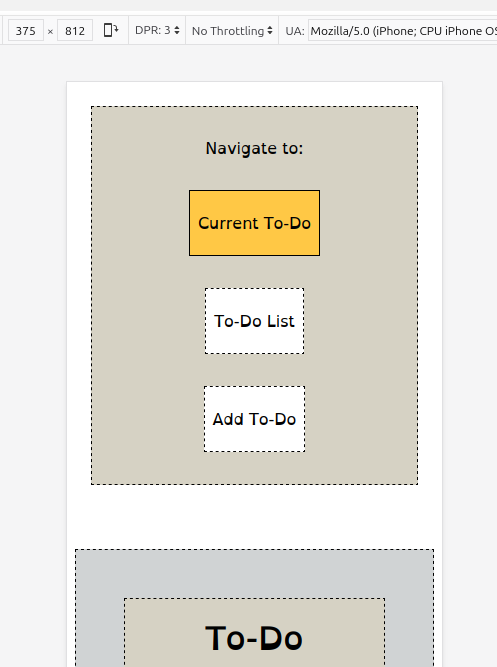
    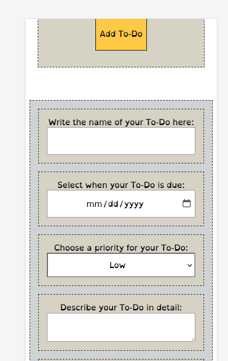
    

6. 2.4.11 Focus Not Obscure
    
   When a user interface component receives keyboard focus, the component is not entirely hidden due to author-created content.
    
    
   Dieser Fall trifft auf meiner Seite auf die Detail-Ansicht von To-Dos auf der To-Do-List-Seite zu.
   Dort wird ein Overlay erzeugt welches andere Elemente der Seite verdeckt.
   Damit die verdeckten Elemente nicht mehr über die Tastatur angewählt werden können, verwende ich das Dialog-Element, welches automatisch beim öffnen dafür sorgt, dass alles, was nicht Teil des Dialog-Modals ist, nicht mehr über die Tastatur ansteurbar ist.
   Auf dem Rest der Seiten existieren sonst keine Interaktionen, die etwas verdecken könnten.
    
   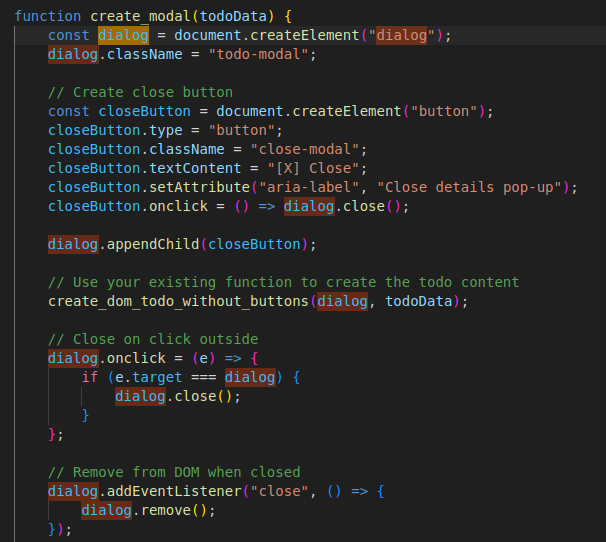

### AAA
1. 2.5.5 Target Size
     
    The size of the target for pointer inputs is at least 44 by 44 CSS pixels
    - Meine Font-Größe ist 16px, basierend darauf habe ich jedem anklickbaren Element eine Mindestgröße von mindestens 3rem (3 * Font-Größe) zugewiesen.
     
    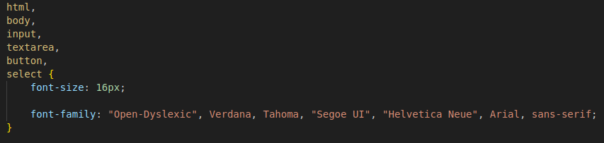
    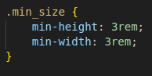

2. 2.4.13 Focus Appearance
     
    When the keyboard focus indicator is visible, an area of the focus indicator meets all the following:
     
     
    ... is at least as large as the area of a 2 CSS pixel thick perimeter of the unfocused component or sub-component
     
     
    ... has a contrast ratio of at least 3:1 between the same pixels in the focused and unfocused states.
    - Fokussierte Elemente haben eine Border mit der Strichstärke 0.25rem (0.25 * 16px = 4px).
     
      Die Farben für die Kontraste habe ich von der folgenden Seite https://www.sussex.ac.uk/tel/resource/tel_website/accessiblecontrast
     
    Die Farben habe ich dann nochmal mit einem Kontrast-Checker für die schwarze Farbe von den Rahmen geprüft.
     
    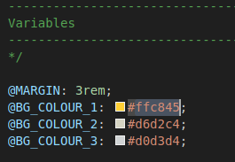
    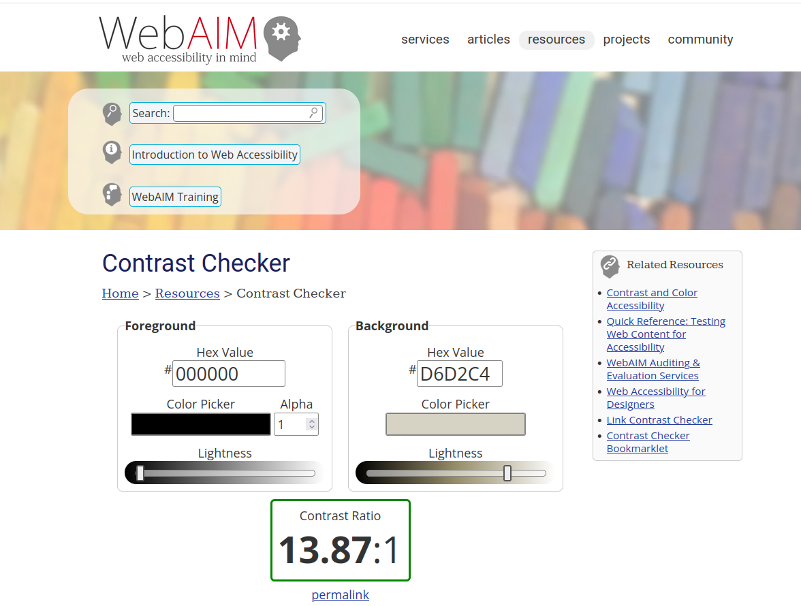
    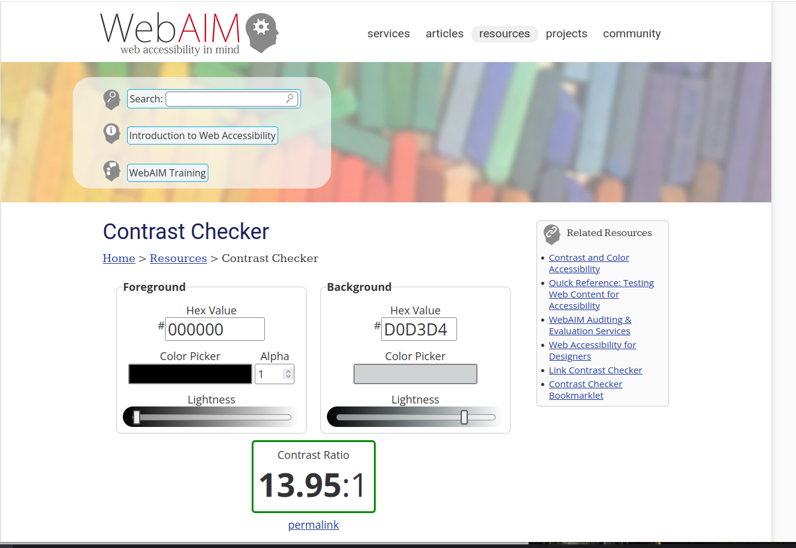
    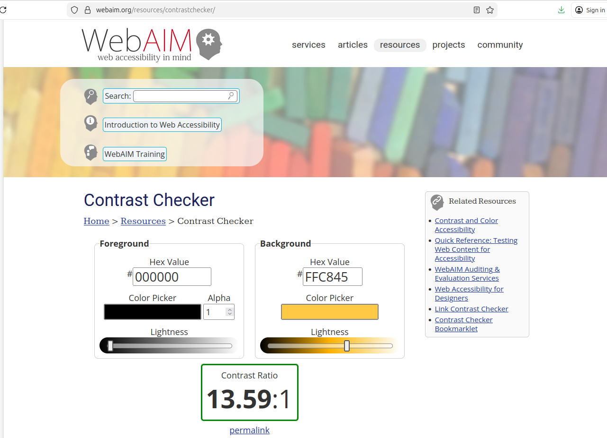
    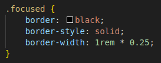

3. 2.4.9 Link Purpose
    A mechanism is available to allow the purpose of each link to be identified from link text alone, except where the purpose of the link would be ambiguous to users in general.
    - Die Links die auf der Seite existieren (Navigationszeile) wurden durch die Namen der Seiten auf welche diese führen dargestellt.
     
    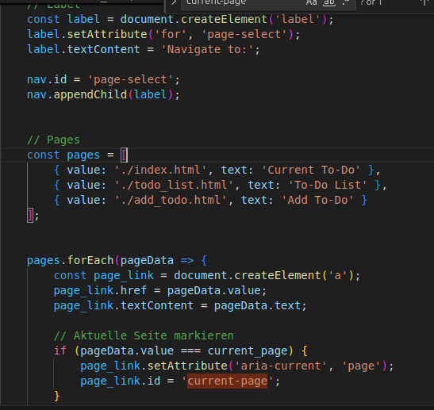

4. 1.4.6 Contrast
    
   The visual presentation of text and images of text has a contrast ratio of at least 7:1, except for the following
   - Der Text erfüllt überall den Kontrast.
  
  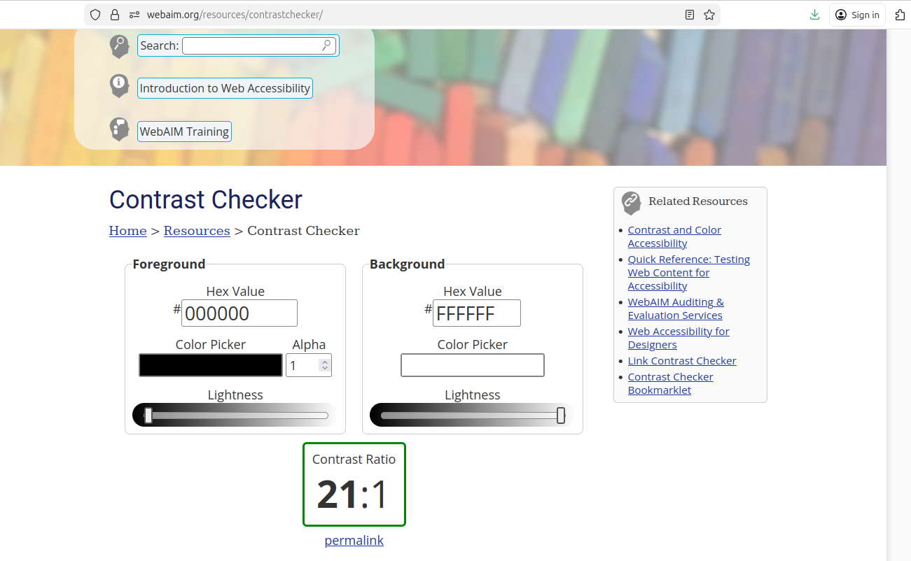

5. 2.1.3 Keyboard Navigation
     
    All functionality of the content is operable through a keyboard interface without requiring specific timings for individual keystrokes. 
    - Die gesamte Seite ist navigierbar mit der Tastatur über Tab.
     
    Ich habe zudem für die Abschnitte der To-Dos Tabindices eingebunden, um die Navigation besser zu strukturieren.

6. 2.4.8 Location
    
   Information about the user's location within a set of web pages is available.
   - Die Navigationszeile im Header higlighted die momentan ausgewählte Seite, und weißt ihr das Aria-Attribut "aria-current" zu, für den Kontext "page".
   
  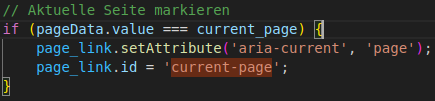
  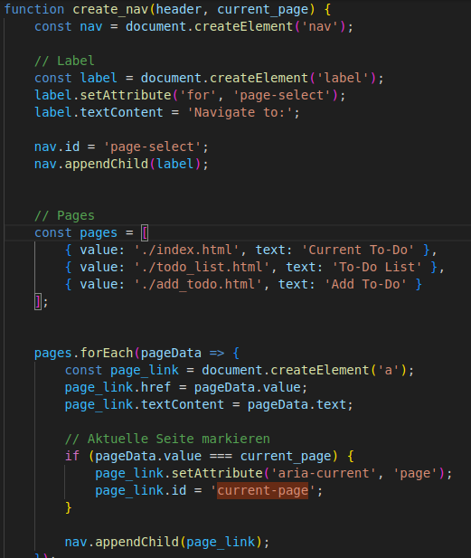